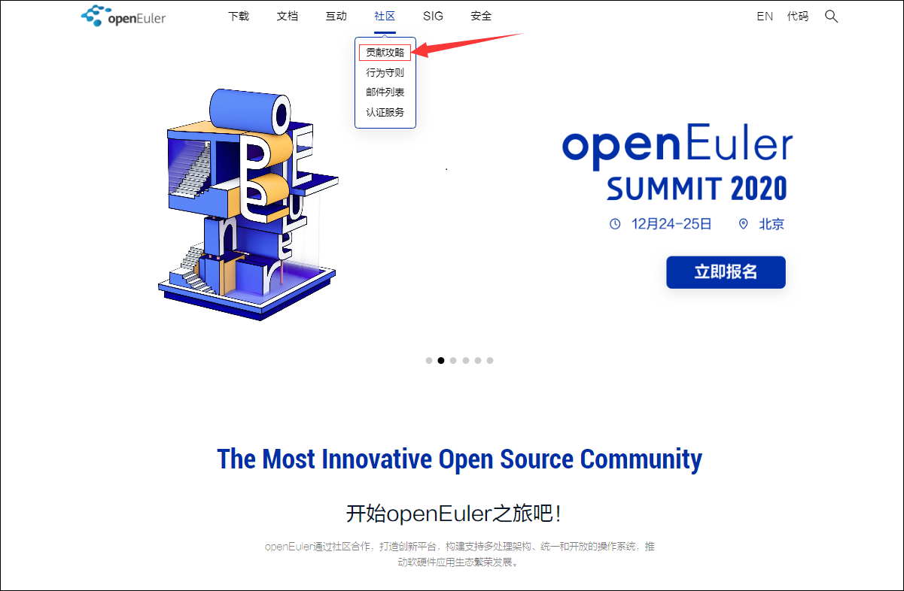
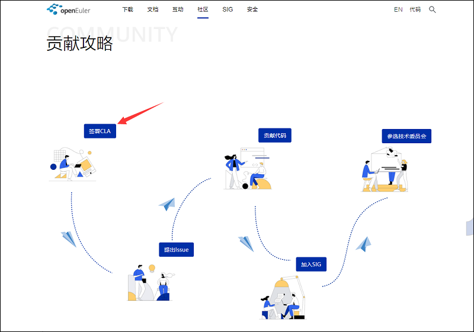
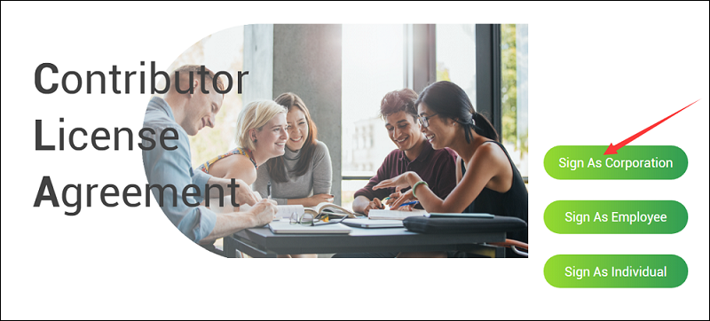
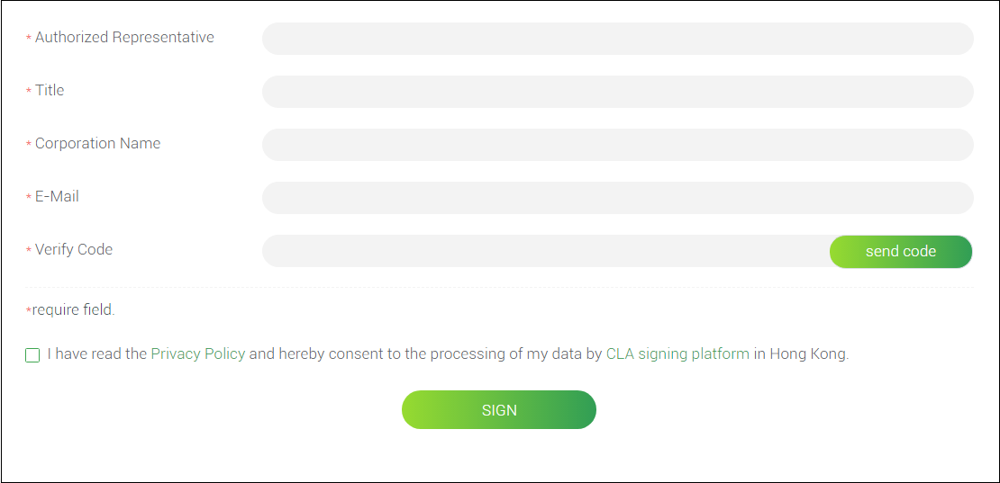
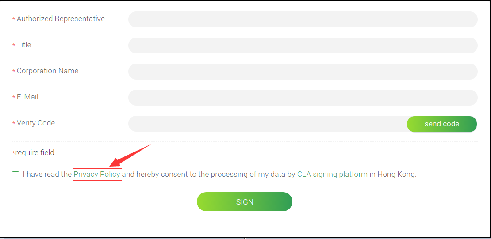
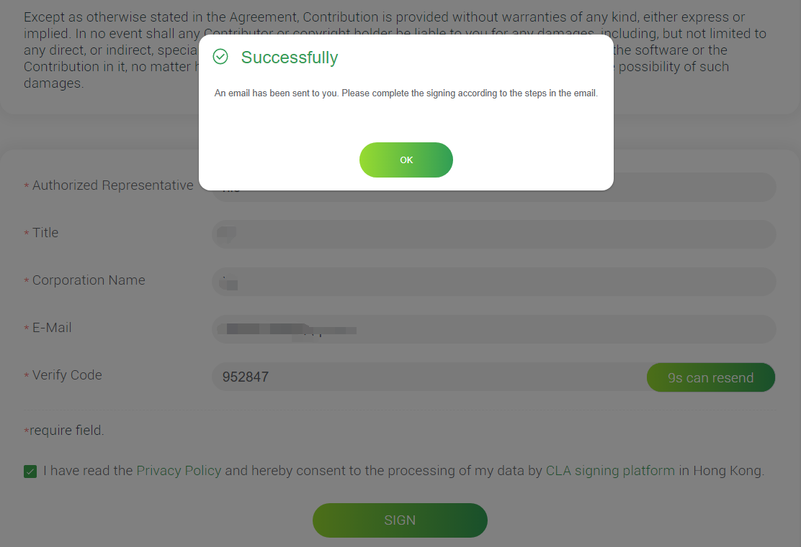
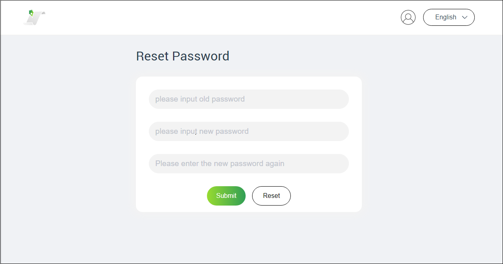
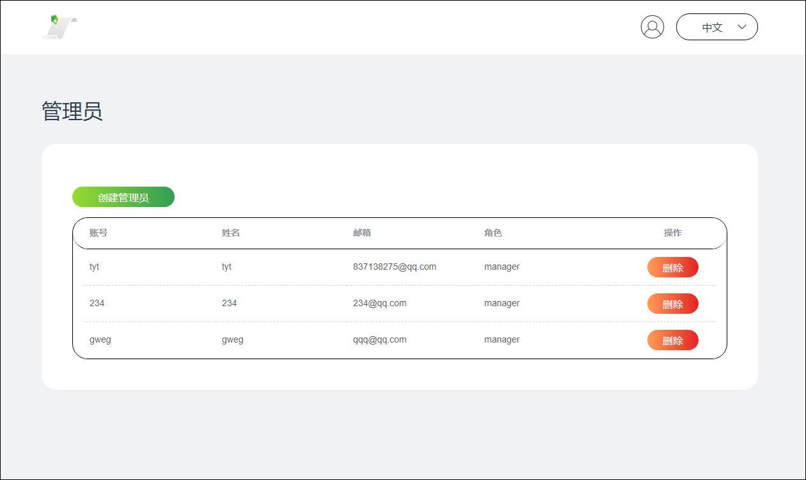

---

---

<h1 id="cla签署流程">CLA签署流程</h1>
<h2 id="如果您是企业签署责任人">如果您是企业签署责任人</h2>
<ol>
<li><strong>您需要代表企业完成企业CLA文件签署</strong></li>
<li><strong>您需要为企业指定授权管理员</strong></li>
</ol>
<h3 id="如何完成企业cla文件签署">如何完成企业CLA文件签署</h3>
<ol>
<li>

从<a href="https://openeuler.org">openEuler官方网站</a>首页社区版块进入<a href="https://openeuler.org/zh/community/contribution/">贡献攻略</a> 

</li>
<li>

通过<a href="https://openeuler.org/zh/community/contribution/">贡献攻略</a>点击<strong>签署CLA</strong>进入<a href="https://clasign.osinfra.cn/sign/Z2l0ZWUlMkZvcGVuZXVsZXI=">CLA签署</a>页面 

</li>
<li>

CLA签署页面 

</li>
<li>

点击<strong>Sign As Corporation/公司签署</strong>进入公司签署页面，请仔细阅读CLA签署内容，然后下拉至底部填写签署表单 

</li>
</ol>

<table>
<thead>
<tr>
<th align="center">字段</th>
<th align="center">含义</th>
</tr>
</thead>
<tbody>
<tr>
<td align="center">Authorized Representavite</td>
<td align="center">公司法定代表</td>
</tr>
<tr>
<td align="center">Title</td>
<td align="center">职位</td>
</tr>
<tr>
<td align="center">Corporation Name</td>
<td align="center">公司完整名称</td>
</tr>
<tr>
<td align="center">E-Mail</td>
<td align="center">公司邮箱</td>
</tr>
<tr>
<td align="center">Verify Code</td>
<td align="center">验证码</td>
</tr>
</tbody>
</table><ol start="5">
<li>

点击复选框中的<strong>Privacy Policy/隐私政策</strong>查看隐私政策，确认无误之后开始填写信息。 

</li>
<li>

信息完善之后，点击<strong>Send Code/发送验证码</strong>，系统会发送一封主题为“企业CLA签署验证码”的邮件到您的邮箱，请登录邮箱，将邮件中的验证码填入签署页面的<strong>Verify code/验证码</strong>中。

</li>
</ol>
<ul>
<li>勾选“我已阅读私隐政策”复选框，点击<strong>SIGN/签署</strong>，将会弹出如下对话框。 
</li>
</ul>
<ol start="7">
<li>

随后，您会收到一封主题为“企业CLA签署”的邮件，附件是包含了贡献者协议与您刚提交的签署信息的pdf文件。

</li>
<li>

您需要下载打印该pdf文件，在最后一页完成签字。扫描签字后的文件保存为pdf文件，将该文件作为附件回复“企业CLA签署”邮件。

</li>
<li>

<em>该步骤由社区管理员操作：社区管理员收到您的回复邮件，会审查附件中的pdf文件。审查通过后，社区管理者将上传该附件到CLA签署平台，同时为您的企业开通Administrator账号，该账号可用于登录管理平台，相关的账号和密码将以邮件形式发送给您。</em>

</li>
<li>

如果您收到一封主题为“XX企业在XX社区的CLA Administrator 账号”的邮件，这代表社区接收了您对相应社区的企业CLA签署，至此签署完成。

</li>
</ol>
<h3 id="如何为企业指定授权管理员">如何为企业指定授权管理员</h3>
<ol>
<li>

<a href="https://clasign.osinfra.cn/sign/Z2l0ZWUlMkZvcGVuZXVsZXI=">签署页面</a>的<strong>Signing CLA Guide for Corporation/CLA签署指南-公司</strong>下拉至底部点击<strong>Administrator platform/管理平台</strong>即可跳转到<a href="https://clasign.osinfra.cn/corporationManagerLogin">CLA管理系统登录</a>页面。 

</li>
<li>

使用社区给您发送的账号信息，登录CLA管理系统页面 

</li>
<li>

首次进入CLA管理系统之后需要修改密码 

</li>
<li>

作为超级管理员，您有权对管理员进行增删操作。至少需要配置一位管理员以确保员工正常签署，最多可以配置5位管理员。当您新增管理员时系统会生成随机密码并邮件通知到该管理员。 

</li>
<li>

至此，授权管理员操作完成，您后续可根据企业需求动态调整管理员名单。

</li>
</ol>

