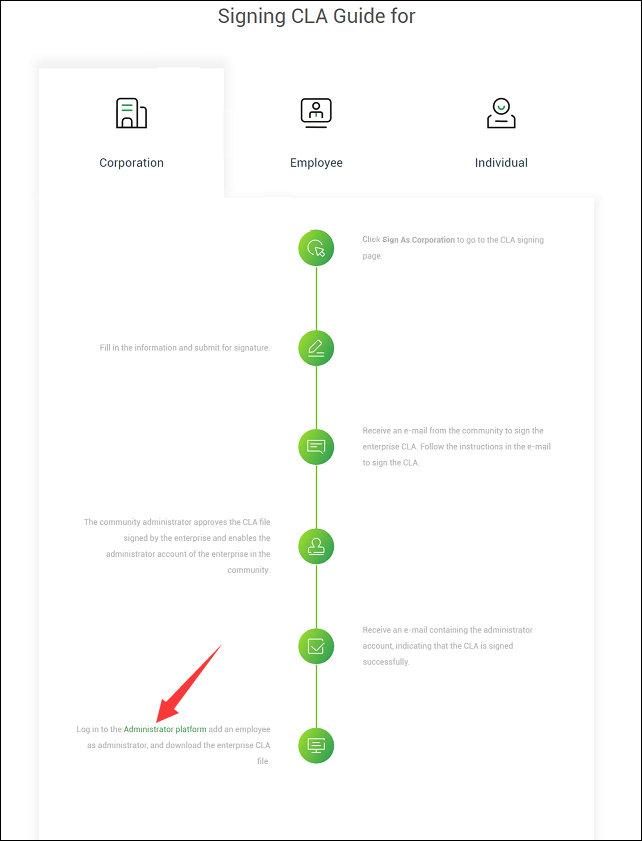
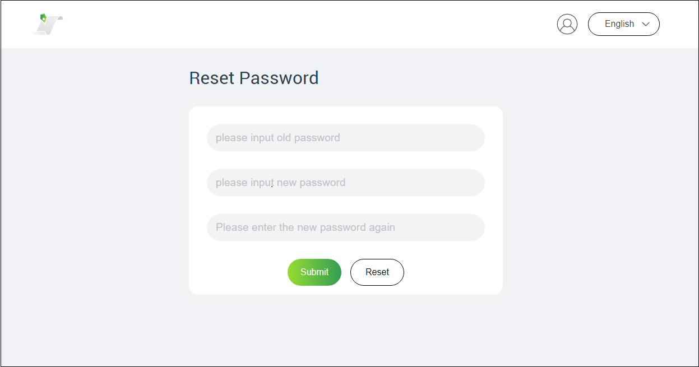

---

---

<h1 id="cla-signing-process">CLA Signing Process</h1>
<h2 id="if-you-are-the-cla-signing-owner-of-an-enterprise">If you are the CLA signing owner of an enterprise:</h2>
<ol>
<li><strong>You need to sign the enterprise CLA on behalf of the enterprise.</strong></li>
<li><strong>You need to specify an authorized administrator for the enterprise.</strong></li>
</ol>
<h3 id="how-do-i-sign-an-enterprise-cla">How Do I Sign an Enterprise CLA?</h3>
<ol>
<li>

Go to the Community section on the homepage of the <a href="https://openeuler.org/en/">openEuler official website</a>and click <a href="https://openeuler.org/en/community/contribution/">Contribution</a>. 

</li>
<li>

Click <strong>Sign CLA</strong> to go to the <a href="https://clasign.osinfra.cn/sign/Z2l0ZWUlMkZvcGVuZXVsZXI=">CLA signing page</a> . 

</li>
<li>

CLA signing page 

</li>
<li>

Click <strong>Sign As Corporation</strong>, read the CLA signing agreement, and then drag down to the bottom to fill in the signing form. 

</li>
</ol>

<table>
<thead>
<tr>
<th align="center">Information</th>
<th align="center">Description</th>
</tr>
</thead>
<tbody>
<tr>
<td align="center">Authorized Representavite</td>
<td align="center">Legal representative of your corporation</td>
</tr>
<tr>
<td align="center">Title</td>
<td align="center">Title of the representative</td>
</tr>
<tr>
<td align="center">Corporation Name</td>
<td align="center">Name of corporation</td>
</tr>
<tr>
<td align="center">E-Mail</td>
<td align="center">Email address of corporation</td>
</tr>
<tr>
<td align="center">Verify Code</td>
<td align="center">Verification code</td>
</tr>
</tbody>
</table><ol start="5">
<li>

Click <strong>Privacy Policy</strong> in the check box to view the privacy policy. After confirming that the privacy policy is correct, fill in the information. 

</li>
<li>

After completing the information, click <strong>send code</strong>. The system will send an email titled “Enterprise CLA Signing Verification Code” to your email box. Log in to your email box to get the verification code and then enter it in <strong>Verify Code</strong> on the signing page…

</li>
<li>

Select the checkbox of ‘‘I have read the Privacy Policy’’ and click <strong>SIGN</strong>. The following dialog box is displayed.。 

</li>
<li>

You will then receive an email titled “Enterprise CLA Signing”. The attachment of this email is a PDF file containing the Contributor License Agreement and the information you submitted.。 

</li>
<li>

You need to download and print the PDF file and sign on the last page. Scan the signed file and save it as a PDF file, and reply to the email titled “Enterprise CLA Signing” with the PDF file as the attachment. 

</li>
<li>

<em>By the community administrator：The community administrator receives your reply email and reviews the PDF file in the attachment. After the application is approved, the community administrator uploads the attachment to the CLA signing platform and creates an administrator account for your enterprise. The administrator account can be used to log in to the management platform. The account and password will be sent to you by email.</em>

</li>
<li>

If you receive an email titled “CLA Administrator Account of XX Enterprise in XX Community”, it indicates that the community has approved your CLA signing. The signing is completed.

</li>
</ol>
<h3 id="how-can-i-specify-an-authorized-administrator-for-an-enterprise">How Can I Specify an Authorized Administrator for an Enterprise?</h3>
<ol>
<li>

Click <strong>Signing CLA Guide for Corporation</strong> on the <a href="https://clasign.osinfra.cn/corporationManagerLogin">Signing Page</a> and drag down to the bottom to click Administrator platform to go to the <a href="https://clasign.osinfra.cn/corporationManagerLogin">login page of the CLA management system</a> 

</li>
<li>

Use the account sent by the community to log in to the CLA management system. 

</li>
<li>

You need to change the password after logging in to the CLA management system for the first time. 

</li>
<li>

As a super administrator, you have the right to add or delete an administrator. At least one administrator is required to ensure that employees can sign the agreement. You can specify a maximum of five administrators. When you add an administrator, the system generates a random password and sends an email to notify the administrator. 

</li>
<li>

The administrator authorization is completed. You can dynamically adjust the administrator list based on enterprise requirements.

</li>
</ol>

