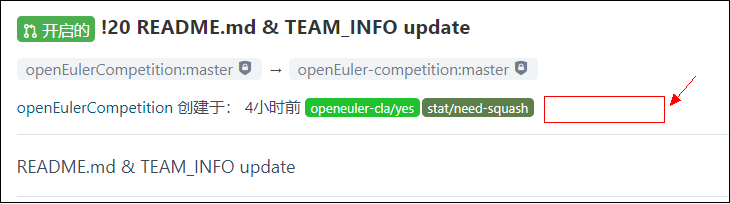

---

---

<h1 id="how-to-merge-（for-maintainer）">How To Merge （for maintainer）?</h1>
<ol>
<li>检查PR标签状态：重点关注PR是否有<strong>ci_failed</strong> 或者<strong>ci_successful</strong> 标签 
</li>
<li>如果有<strong>ci_successful</strong>绿色标签，表示后台部分的检查已经通过，请执行第5步检查。 
</li>
<li>如果有<strong>ci_failed</strong>红色标签，表示后台检查未通过，检查未通过的具体项目会在PR的评论信息中提示；请执行第4步；(如果没有解决问题，带有问题执行步骤6进行强制合入，会导致自动建仓库失败) 
 
</li>
<li>通知提交人（评论中@提交人）按要求修改，再重新提交PR。</li>
<li>点击PR的<strong>文件</strong>查看修改差异，确认是否所有信息都是按照要求填写；如果检查有问题，请执行第4步；如果确认OK，请执行第6步骤； 
</li>
<li>在PR评论区评论 <strong>/lgtm</strong> 和 <strong>/approve</strong>，完成后进行第7步确认； 
 
</li>
<li>检查PR是否已经为 <strong>已合入</strong>，如果状态为<strong>开启的</strong>请及时 <em>@georgecao</em>； 
</li>
</ol>

