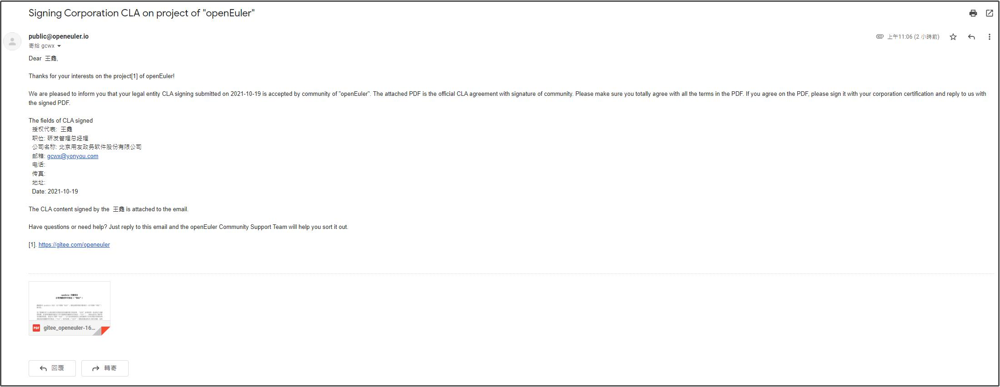
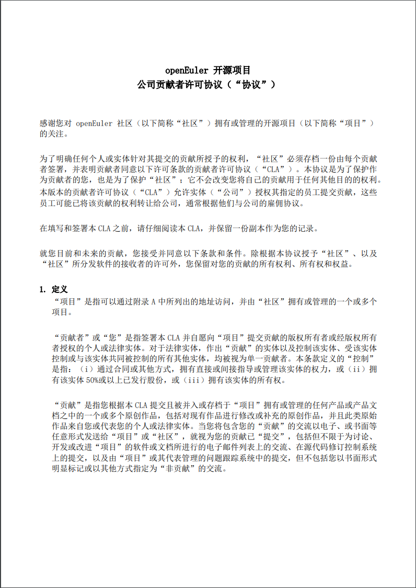
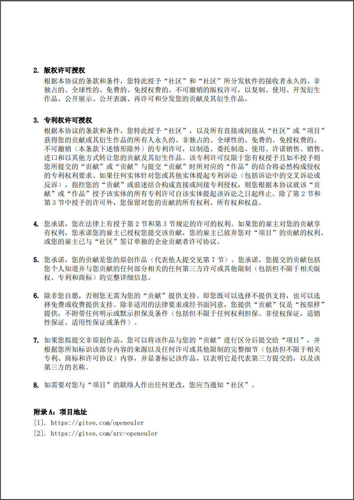
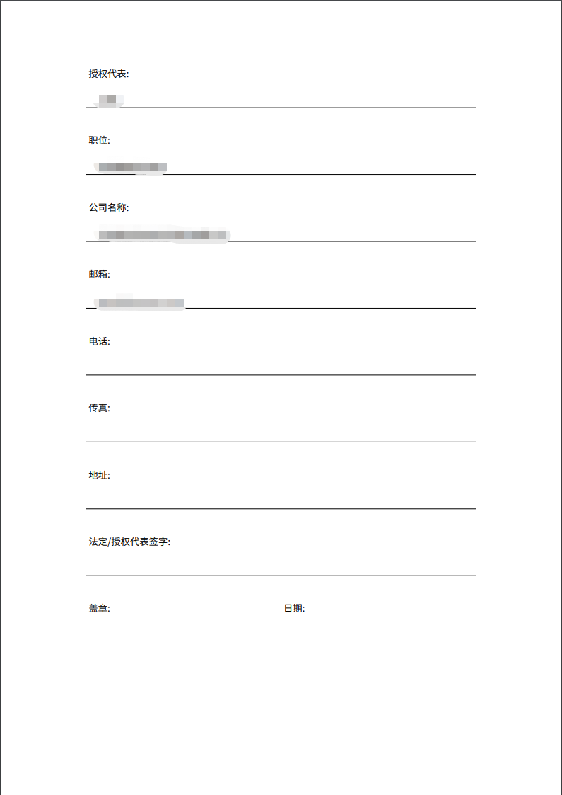

## 企业如何签署社区贡献者协议
请按照以下流程操作：
[enter link description here](https://gitee.com/openeuler/infrastructure/blob/master/docs/cla-guide/sign-as-corporation.md)
## 企业在社区签署贡献者协议后
1. 社区将会通过public@openeuler.io邮箱向企业签署者邮箱发送协议邮件：
<kbd></kbd>
2.  附件为协议内容和需要签署的内容：
<kbd></kbd>
<kbd></kbd>
<kbd></kbd>

